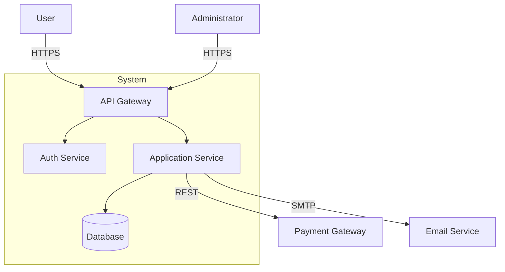
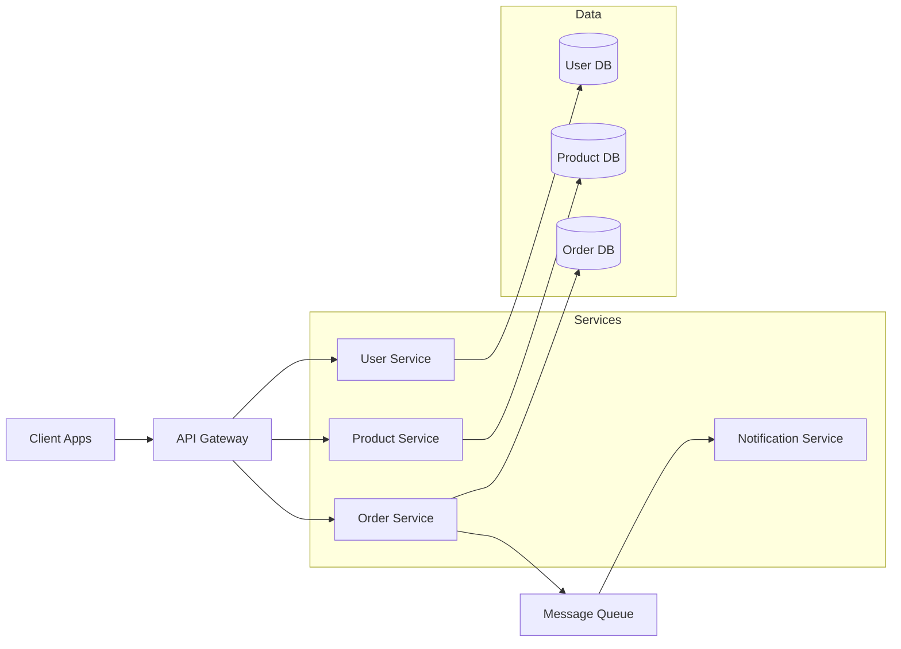
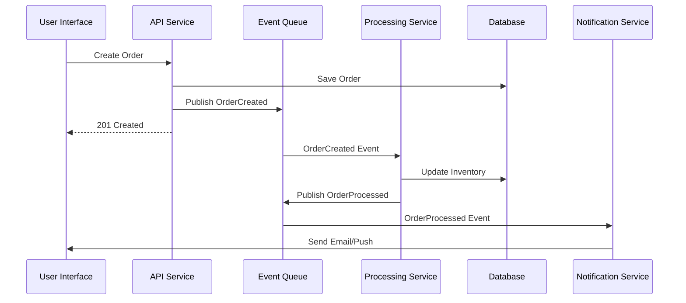
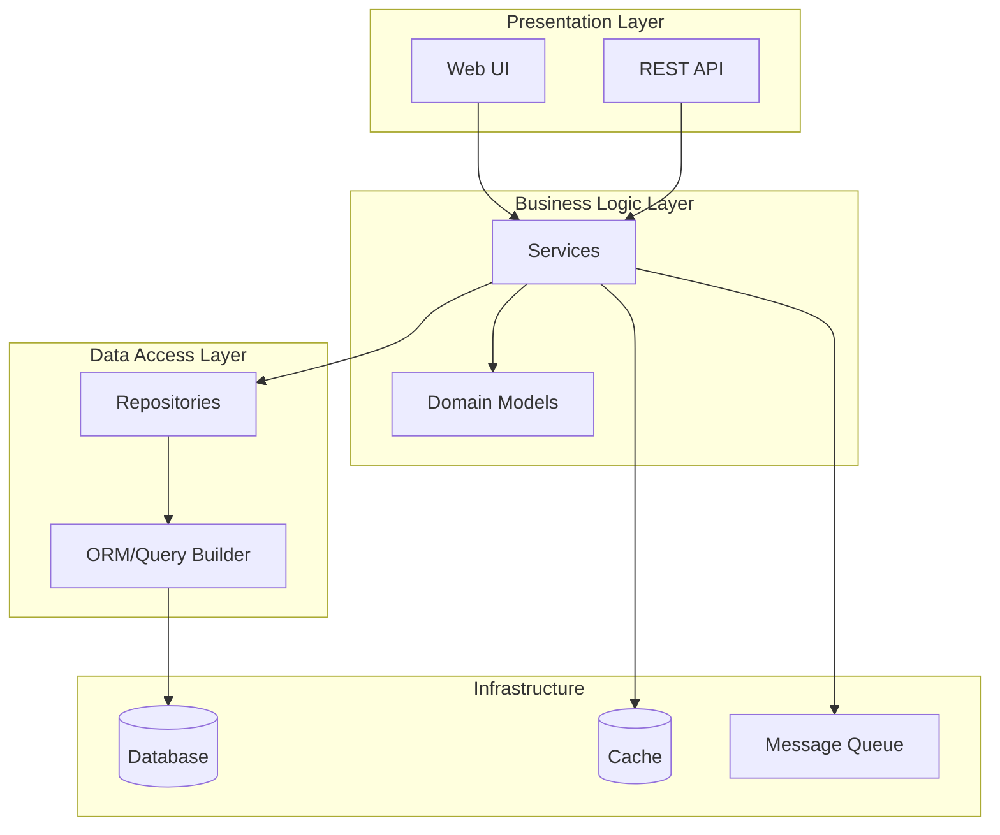

# System Architecture Advisor

## Overview

Expert guidance for designing robust, scalable, and maintainable software architectures. Assists with architecture patterns, API design, tech stack selection, visual system diagrams, and best practices for modern application development.

**When to use this skill:**
- Designing new system architecture
- Evaluating or refactoring existing architecture
- Choosing between architecture patterns
- Planning API design (REST, GraphQL, RPC)
- Creating system diagrams and documentation
- Stack selection and technology evaluation
- Scalability and performance planning
- Security architecture design

---

## Core Architecture Patterns

### Pattern Selection Framework

**Assess these factors first:**

1. **Scale Requirements**
   - Current users: <1K, 1K-100K, 100K-1M, >1M
   - Growth projection: 6 months, 1 year, 3+ years
   - Geographic distribution: Single region, multi-region, global

2. **Team Structure**
   - Team size: 1-3, 4-10, 11-50, 50+
   - Team distribution: Co-located, distributed, hybrid
   - Technical expertise: Junior, mixed, senior

3. **Business Constraints**
   - Time to market: Critical, normal, flexible
   - Budget: Startup, growth, enterprise
   - Compliance: Standard, regulated industry, highly regulated

### Architecture Pattern Decision Tree

**Start here and follow the path:**

```
Is this a new project or refactoring existing?
│
├─ NEW PROJECT
│  │
│  ├─ Team size 1-3, MVP needed fast?
│  │  └─→ **MONOLITH** (Layered or Modular)
│  │
│  ├─ Multiple teams, different domains?
│  │  └─→ **MICROSERVICES**
│  │
│  ├─ Event-heavy, real-time processing?
│  │  └─→ **EVENT-DRIVEN ARCHITECTURE**
│  │
│  └─ Variable workload, cost-sensitive?
│     └─→ **SERVERLESS**
│
└─ REFACTORING EXISTING
   │
   ├─ Monolith too complex, teams blocked?
   │  └─→ Gradually extract to **MICROSERVICES**
   │
   ├─ Tight coupling causing issues?
   │  └─→ Introduce **EVENT-DRIVEN** patterns
   │
   └─ Cost or scaling issues?
      └─→ Migrate components to **SERVERLESS**
```

---

## Pattern Details with Pros/Cons

### Monolithic Architecture

**When to use:**
- Startups needing fast iteration
- Small teams (1-10 developers)
- Straightforward business logic
- Predictable traffic patterns

**Structure:**
```
Layered Monolith:
├─ Presentation Layer (UI/API)
├─ Business Logic Layer
├─ Data Access Layer
└─ Database

Modular Monolith:
├─ User Module (domain-driven)
├─ Product Module
├─ Order Module
├─ Payment Module
└─ Shared Kernel
```

**Pros:**
- Simple deployment and debugging
- Easier local development
- ACID transactions work naturally
- Lower operational complexity

**Cons:**
- Scales as single unit (all or nothing)
- Technology lock-in
- Longer build/test times as app grows
- Team conflicts in large codebases

**Example Stack:**
- **Next.js + Supabase:** Modern, production-ready monolith
- **Django + PostgreSQL:** Batteries-included framework
- **Rails + PostgreSQL:** Convention over configuration

---

### Microservices Architecture

**When to use:**
- Multiple teams working independently
- Different domains with distinct scaling needs
- Need for technology diversity
- Mature DevOps capabilities

**Structure:**
```
API Gateway
├─ User Service (Node.js)
├─ Product Service (Go)
├─ Order Service (Python)
├─ Payment Service (Java)
└─ Notification Service (Serverless)

Each service:
├─ Own database
├─ Independent deployment
└─ RESTful/gRPC APIs
```

**Pros:**
- Independent scaling per service
- Technology flexibility
- Team autonomy
- Fault isolation

**Cons:**
- Distributed system complexity
- Network latency between services
- Eventual consistency challenges
- Higher operational overhead

**Key Patterns:**
- **API Gateway:** Single entry point, request routing
- **Service Discovery:** Dynamic service location
- **Circuit Breaker:** Prevent cascading failures
- **Saga Pattern:** Distributed transactions

---

### Event-Driven Architecture

**When to use:**
- Real-time data processing
- Decoupled components needed
- Asynchronous workflows
- IoT or streaming data

**Structure:**
```
Event Producers → Event Bus → Event Consumers
                    │
                (Kafka/RabbitMQ)
                    │
        ┌───────────┼───────────┐
        ↓           ↓           ↓
    Service A   Service B   Service C
```

**Pros:**
- Loose coupling between services
- Excellent scalability
- Asynchronous processing
- Real-time responsiveness

**Cons:**
- Eventual consistency
- Debugging challenges (event flows)
- Event schema management
- Requires message broker infrastructure

**Technologies:**
- **Apache Kafka:** High-throughput, distributed log
- **RabbitMQ:** Feature-rich message broker
- **AWS EventBridge:** Managed event bus
- **Google Pub/Sub:** Cloud-native messaging

---

### Serverless Architecture

**When to use:**
- Variable/unpredictable traffic
- Event-triggered workloads
- Cost optimization priority
- Minimal ops overhead desired

**Structure:**
```
API Gateway → Lambda Functions → Managed Services
              │
              ├─ Auth Function → Cognito
              ├─ CRUD Function → DynamoDB
              └─ Processing Function → S3
```

**Pros:**
- Pay per execution
- Auto-scaling to zero
- No server management
- Fast deployment cycles

**Cons:**
- Cold start latency
- Vendor lock-in risk
- Debugging complexity
- Stateless constraints

**Providers:**
- **AWS Lambda + API Gateway + DynamoDB**
- **Cloudflare Workers + D1 + R2**
- **Vercel Functions + PostgreSQL**
- **Supabase Edge Functions**

---

## API Design Guidance

### REST vs GraphQL vs RPC Decision Matrix

| Factor | REST | GraphQL | gRPC |
|--------|------|---------|------|
| **Best for** | Simple CRUD, public APIs | Complex data fetching | Internal microservices |
| **Performance** | Moderate | Good (no over-fetching) | Excellent (binary) |
| **Learning curve** | Low | Medium | High |
| **Tooling** | Excellent | Good | Good |
| **Caching** | Native HTTP | Custom | Custom |
| **Real-time** | WebSocket add-on | Built-in subscriptions | Streaming RPC |

### REST API Best Practices

**Resource naming:**
```
GET    /users              # List users
POST   /users              # Create user
GET    /users/{id}         # Get user
PUT    /users/{id}         # Update user (full)
PATCH  /users/{id}         # Update user (partial)
DELETE /users/{id}         # Delete user

# Nested resources
GET    /users/{id}/orders  # User's orders
POST   /users/{id}/orders  # Create order for user
```

**Response structure:**
```json
{
  "data": { /* response payload */ },
  "meta": {
    "page": 1,
    "per_page": 20,
    "total": 150
  },
  "links": {
    "self": "/users?page=1",
    "next": "/users?page=2",
    "prev": null
  }
}
```

**Status codes:**
- `200 OK` - Successful GET, PUT, PATCH
- `201 Created` - Successful POST
- `204 No Content` - Successful DELETE
- `400 Bad Request` - Validation error
- `401 Unauthorized` - Missing auth
- `403 Forbidden` - Insufficient permissions
- `404 Not Found` - Resource doesn't exist
- `500 Internal Server Error` - Server failure

### GraphQL API Patterns

**Schema design:**
```graphql
type User {
  id: ID!
  name: String!
  email: String!
  orders: [Order!]!
}

type Order {
  id: ID!
  total: Float!
  items: [OrderItem!]!
  user: User!
}

type Query {
  user(id: ID!): User
  users(limit: Int, offset: Int): [User!]!
}

type Mutation {
  createUser(input: CreateUserInput!): User!
  updateUser(id: ID!, input: UpdateUserInput!): User!
}

type Subscription {
  orderCreated: Order!
}
```

**Pros:**
- Single endpoint
- Client specifies needed fields
- Strong typing
- Real-time with subscriptions

**Cons:**
- Caching complexity
- N+1 query problem (use DataLoader)
- Learning curve for teams

---

## Tech Stack Recommendations

### Full-Stack JavaScript (Modern SaaS)

**Stack:** Next.js + Supabase + Vercel
```
Frontend: Next.js 15 (App Router)
Backend: Next.js API Routes + Supabase Edge Functions
Database: PostgreSQL (Supabase)
Auth: Supabase Auth
Storage: Supabase Storage
Hosting: Vercel (frontend), Supabase (backend)
```

**Pros:**
- Single language (TypeScript)
- Fast development
- Excellent DX
- Built-in auth, storage, real-time

**Cons:**
- Vendor lock-in (mitigated: open-source)
- Limited to JavaScript ecosystem

**Perfect for:** SaaS products, web apps, MVPs

---

### Python Backend + React Frontend

**Stack:** FastAPI + PostgreSQL + React + AWS
```
Frontend: React + Vite + TanStack Query
Backend: FastAPI (Python)
Database: PostgreSQL
Cache: Redis
Deployment: AWS ECS/Lambda + S3 + CloudFront
```

**Pros:**
- Python for data-heavy backend
- Rich ML/data science ecosystem
- React for modern UI
- AWS flexibility

**Cons:**
- More moving parts
- Two languages to maintain

**Perfect for:** Data-intensive apps, ML integration, complex business logic

---

### Enterprise .NET

**Stack:** ASP.NET Core + SQL Server + Azure
```
Backend: ASP.NET Core Web API
Database: SQL Server / CosmosDB
Frontend: Blazor / React
Deployment: Azure App Service + Azure SQL
```

**Pros:**
- Enterprise-grade tooling
- Excellent IDE support (Visual Studio)
- Strong type safety
- Azure integration

**Cons:**
- Microsoft ecosystem lock-in
- Higher learning curve

**Perfect for:** Enterprise applications, financial systems, compliance-heavy domains

---

## Visual Diagrams with Mermaid

### System Context Diagram



### Microservices Architecture



### Event-Driven Flow



### Layered Architecture



---

## Security Architecture Principles

### Security Boundaries

**1. Network Security**
```
Internet → WAF/CDN → Load Balancer → Private Network
                                     ├─ Web Tier (DMZ)
                                     └─ App Tier (Private)
                                        └─ Data Tier (Isolated)
```

**2. Authentication & Authorization**
- **Authentication:** OAuth 2.0 + OIDC (Supabase Auth, Auth0, Cognito)
- **Authorization:** RBAC (Role-Based) or ABAC (Attribute-Based)
- **API Security:** JWT tokens, API keys with rate limiting

**3. Data Protection**
- **In Transit:** TLS 1.3
- **At Rest:** AES-256 encryption
- **Secrets Management:** Vault, AWS Secrets Manager, or environment variables

### Security Checklist

- [ ] HTTPS everywhere (no HTTP)
- [ ] Input validation and sanitization
- [ ] OWASP Top 10 mitigations
- [ ] Rate limiting on public APIs
- [ ] SQL injection prevention (parameterized queries)
- [ ] XSS prevention (output encoding)
- [ ] CSRF protection
- [ ] Security headers (CSP, HSTS, etc.)
- [ ] Regular dependency updates
- [ ] Secrets never in code/repos

---

## Scalability Patterns

### Horizontal vs Vertical Scaling

**Vertical Scaling (Scale Up):**
- Add more resources to single server
- Simpler to implement
- Physical limits

**Horizontal Scaling (Scale Out):**
- Add more servers
- Load balancer required
- Better fault tolerance
- Preferred for high scale

### Caching Strategy

**Multi-Level Cache:**
```
Request → CDN Cache → Application Cache → Database
          (Static)    (Redis/Memcached)
```

**Cache Patterns:**
1. **Cache-Aside:** App loads from cache, fetches from DB on miss
2. **Write-Through:** App writes to cache and DB simultaneously
3. **Write-Behind:** App writes to cache, async writes to DB

### Database Scaling

**Read Scaling:**
- **Read Replicas:** Route read queries to replicas
- **CQRS Pattern:** Separate read and write databases

**Write Scaling:**
- **Sharding:** Partition data across multiple databases
- **Federation:** Split by function (users DB, orders DB, products DB)

---

## Folder Structure Recommendations

### Next.js App Router (2025)

```
src/
├── app/
│   ├── (auth)/               # Route group
│   │   ├── login/
│   │   └── register/
│   ├── (dashboard)/
│   │   ├── layout.tsx
│   │   ├── page.tsx
│   │   └── settings/
│   ├── api/
│   │   ├── users/route.ts
│   │   └── auth/route.ts
│   └── layout.tsx            # Root layout
├── components/
│   ├── ui/                   # shadcn components
│   ├── forms/
│   └── layouts/
├── lib/
│   ├── db/                   # Database client
│   ├── auth/                 # Auth utilities
│   └── utils.ts
├── hooks/                    # Custom React hooks
└── types/                    # TypeScript types
```

### Python FastAPI

```
app/
├── api/
│   ├── __init__.py
│   ├── dependencies.py
│   └── routes/
│       ├── users.py
│       ├── products.py
│       └── orders.py
├── core/
│   ├── config.py
│   ├── security.py
│   └── database.py
├── models/                   # SQLAlchemy models
│   ├── user.py
│   └── product.py
├── schemas/                  # Pydantic schemas
│   ├── user.py
│   └── product.py
├── services/                 # Business logic
│   ├── user_service.py
│   └── order_service.py
├── main.py
└── tests/
```

---

## Best Practices Summary

### Separation of Concerns

**Principle:** Each component has single responsibility.

**Example:**
```
✅ Good:
- UserController: Handle HTTP requests
- UserService: Business logic
- UserRepository: Database operations

⌠Bad:
- UserController: HTTP + business logic + database
```

### Dependency Inversion

**Principle:** Depend on abstractions, not concretions.

**Example:**
```typescript
// ✅ Good
interface IEmailService {
  sendEmail(to: string, subject: string, body: string): Promise<void>;
}

class OrderService {
  constructor(private emailService: IEmailService) {}
}

// ⌠Bad
class OrderService {
  constructor(private emailService: GmailService) {} // Concrete dependency
}
```

### API Design Anti-Patterns to Avoid

- ⌠Chatty APIs (too many requests needed)
- ⌠Overfetching (returning too much data)
- ⌠Deeply nested resources (`/users/123/orders/456/items/789`)
- ⌠RPC-style endpoints in REST (`/getUserOrders`, `/createOrderForUser`)
- ⌠Inconsistent naming
- ⌠Missing pagination
- ⌠No versioning strategy

---

## Decision Framework Template

When recommending architecture, consider:

1. **Current State:**
   - Existing system or greenfield?
   - Team skills and size?
   - Current pain points?

2. **Requirements:**
   - Performance needs?
   - Scale expectations?
   - Budget constraints?
   - Time to market?

3. **Trade-offs:**
   - Complexity vs flexibility?
   - Cost vs performance?
   - Speed vs correctness?

4. **Future-Proofing:**
   - Growth trajectory?
   - Technology evolution?
   - Team expansion plans?

**Output:** Clear recommendation with reasoning, diagrams, and migration path (if refactoring).

---

## Example Usage Patterns

**Request:** "Design architecture for a SaaS product with 100K users"

**Response includes:**
1. Recommended pattern (likely Modular Monolith → Microservices path)
2. Tech stack (Next.js + Supabase + Vercel)
3. System diagram (Mermaid)
4. Folder structure
5. Scaling plan
6. Security considerations
7. Migration strategy

**Request:** "Should I use REST or GraphQL for my e-commerce API?"

**Response includes:**
1. Comparison matrix
2. Recommendation based on context
3. Example schema/endpoints
4. Performance considerations
5. Implementation guidance

---

## References

For detailed architectural patterns and examples, see:
- Official Next.js documentation for App Router patterns
- AWS Well-Architected Framework for cloud architecture
- Martin Fowler's patterns catalog for enterprise patterns
- Microservices.io for microservices patterns
- The Twelve-Factor App for modern app principles
