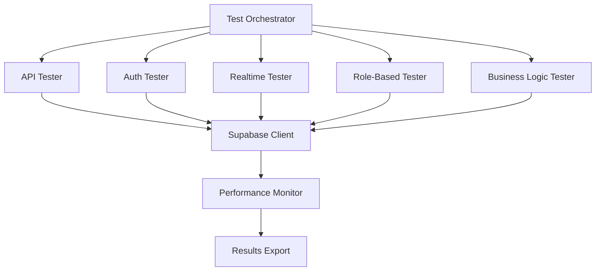

# Georgian Distribution System - Testing Documentation

## Table of Contents

1. [Testing System Overview](#1-testing-system-overview)
2. [Available Test Commands](#2-available-test-commands)
3. [Setup Instructions](#3-setup-instructions)
4. [Environment Configuration](#4-environment-configuration)
5. [Test Suite Categories](#5-test-suite-categories)
6. [Troubleshooting Guide](#6-troubleshooting-guide)
7. [Best Practices](#7-best-practices)
8. [CI/CD Integration](#8-cicd-integration)
9. [Performance Considerations](#9-performance-considerations)
10. [Advanced Features](#10-advanced-features)

---

## 1. Testing System Overview

The Georgian Distribution System features a comprehensive, multi-layered testing infrastructure designed to ensure system reliability, performance, and security across all user roles and system components.

### 🎯 What the Testing System Tests

**Core System Components:**
- **Database Operations**: Supabase API endpoints, CRUD operations, RLS policies
- **Authentication Flow**: Login, logout, registration, password reset, session management
- **Real-time Features**: WebSocket connections, live updates, notification delivery
- **Role-Based Access Control**: Admin, Restaurant, Driver, and Demo user permissions
- **Business Logic**: Order lifecycle, pricing calculations, data integrity
- **Performance**: Query optimization, load handling, response times

**Quality Assurance:**
- **API Testing**: All Supabase endpoints with proper authentication
- **Security Testing**: SQL injection protection, unauthorized access prevention
- **Load Testing**: Concurrent request handling and resilience
- **Integration Testing**: End-to-end workflows across multiple components

### 🏗️ Architecture



---

## 2. Available Test Commands

### 2.1 Core Test Suites

| Command | Duration | Purpose | Coverage |
|---------|----------|---------|----------|
| `npm run test:smoke` | 2-5 min | Quick validation of core functionality | 20% |
| `npm run test:critical` | 5-10 min | Essential business workflows | 40% |
| `npm run test:regression` | 15-25 min | Full stability testing | 80% |
| `npm run test:full` | 30-50 min | Complete system validation | 100% |

### 2.2 Feature-Specific Tests

| Command | Focus Area | Test Components |
|---------|------------|-----------------|
| `npm run test:api` | API Endpoints | Database operations, CRUD, performance |
| `npm run test:auth` | Authentication | Login, logout, registration, security |
| `npm run test:realtime` | Real-time Features | WebSocket, live updates, notifications |
| `npm run test:business` | Business Logic | Order lifecycle, pricing, integrity |

### 2.3 Role-Specific Tests

| Command | Target Role | Tested Permissions |
|---------|-------------|-------------------|
| `npm run test:admin` | Administrator | Full system access, user management |
| `npm run test:restaurant` | Restaurant Owner | Orders, products, analytics |
| `npm run test:driver` | Driver | Assigned orders, status updates |
| `npm run test:demo` | Demo User | Read-only features, limited access |

### 2.4 Specialized Tests

| Command | Purpose | Use Case |
|---------|---------|----------|
| `npm run test:lifecycle` | Order Processing | Complete order workflows |
| `npm run test:pricing` | Price Calculations | Revenue and pricing accuracy |
| `npm run test:integrity` | Data Consistency | Database integrity validation |

### 2.5 CLI Options

```bash
# Basic usage
npm run test:smoke

# JSON output
npm run test:critical -- --json

# HTML report generation
npm run test:regression -- --html --save

# Custom timeout
npm run test:full -- --timeout 600000

# Role-specific testing
npm run test:roles -- --roles admin,restaurant

# Parallel execution
npm run test:api -- --parallel

# Environment-specific testing
TEST_ENVIRONMENT=production npm run test:full
```

---

## 3. Setup Instructions

### 3.1 Prerequisites

**Required Software:**
- Node.js 18+ with npm
- Git for version control
- Modern web browser for UI testing

**System Requirements:**
- 4GB+ RAM for full test suite
- Stable internet connection for Supabase connectivity
- 2GB+ available disk space for test results

### 3.2 Installation

```bash
# Clone the repository
git clone <repository-url>
cd georgian-distribution-system/frontend

# Install dependencies
npm install

# Install ts-node globally (if not already installed)
npm install -g ts-node

# Verify installation
npm run type-check
```

### 3.3 Environment Setup

```bash
# Copy environment template
cp .env.example .env.local

# Edit with your Supabase credentials
nano .env.local
```

### 3.4 First Test Run

```bash
# Quick smoke test to verify setup
npm run test:smoke

# If successful, run a full test suite
npm run test:full
```

---

## 4. Environment Configuration

### 4.1 Supabase Configuration

**Development Environment:**
```bash
NEXT_PUBLIC_SUPABASE_URL=https://your-project.supabase.co
NEXT_PUBLIC_SUPABASE_ANON_KEY=your-anon-key
SUPABASE_SERVICE_ROLE_KEY=your-service-role-key
NEXT_PUBLIC_APP_URL=http://localhost:3000
```

**Production Environment:**
```bash
NEXT_PUBLIC_SUPABASE_URL=https://data.greenland77.ge
NEXT_PUBLIC_SUPABASE_ANON_KEY=production-anon-key
SUPABASE_SERVICE_ROLE_KEY=production-service-role-key
NEXT_PUBLIC_APP_URL=https://greenland77.ge
```

### 4.2 Test-Specific Environment Variables

```bash
# Test execution settings
TEST_ENVIRONMENT=development
TEST_OUTPUT_FORMAT=console
TEST_SAVE_RESULTS=false
TEST_TIMEOUT=300000
TEST_RESULTS_PATH=./test-results

# Performance testing
TEST_PARALLEL_EXECUTIONS=5
TEST_LOAD_THRESHOLD=100

# Security testing
TEST_SECURITY_MODE=true
TEST_INJECTION_PROTECTION=true
```

### 4.3 Debug Configuration

```bash
# Enable verbose logging
NEXT_PUBLIC_DEBUG_MODE=true
NODE_ENV=development

# Performance monitoring
NEXT_PUBLIC_ENABLE_PERFORMANCE_MONITORING=true
NEXT_PUBLIC_SENTRY_DSN=your-sentry-dsn
```

---

## 5. Test Suite Categories

### 5.1 Smoke Tests (2-5 minutes)

**Purpose:** Quick validation that the system is operational

**Tests Included:**
- Supabase connection validation
- Basic API endpoint accessibility
- Authentication service health check
- Critical database table accessibility
- Real-time service initialization

**When to Use:**
- Development environment checks
- Pre-deployment verification
- Quick system health assessment

**Example Usage:**
```bash
npm run test:smoke
```

### 5.2 Critical Path Tests (5-10 minutes)

**Purpose:** Validate essential business workflows

**Tests Included:**
- User authentication flows
- Order creation and management
- Role-based access controls
- Real-time notification delivery
- Basic performance benchmarks

**When to Use:**
- Pre-release validation
- Production deployment checks
- After critical changes

**Example Usage:**
```bash
npm run test:critical -- --json --save
```

### 5.3 Regression Tests (15-25 minutes)

**Purpose:** Full stability testing after changes

**Tests Included:**
- Complete API endpoint suite
- All authentication scenarios
- Cross-role interaction testing
- Data integrity validation
- Performance regression detection

**When to Use:**
- Before merging feature branches
- After major system updates
- Weekly stability checks

**Example Usage:**
```bash
npm run test:regression -- --html
```

### 5.4 Full Test Suite (30-50 minutes)

**Purpose:** Complete system validation

**Tests Included:**
- All previous test categories
- Load and stress testing
- Security vulnerability assessment
- Cross-browser compatibility
- End-to-end user journeys

**When to Use:**
- Major releases
- System architecture changes
- Quarterly security audits

**Example Usage:**
```bash
TEST_ENVIRONMENT=production npm run test:full -- --parallel
```

---

## 6. Troubleshooting Guide

### 6.1 Common Issues

**Issue: "Supabase connection failed"**
```bash
# Solution: Check environment variables
echo $NEXT_PUBLIC_SUPABASE_URL
echo $NEXT_PUBLIC_SUPABASE_ANON_KEY

# Verify Supabase project status
npm run test:smoke
```

**Issue: "Authentication test failures"**
```bash
# Solution: Check demo account setup
# Create test user in Supabase dashboard
# Verify RLS policies are properly configured
npm run test:auth -- --timeout 60000
```

**Issue: "Real-time subscription timeouts"**
```bash
# Solution: Check network connectivity
# Verify Supabase realtime is enabled
npm run test:realtime -- --timeout 45000
```

**Issue: "Role-based access test failures"**
```bash
# Solution: Verify user roles in database
# Check RLS policies for each role
npm run test:roles -- --roles admin
```

### 6.2 Debug Mode

Enable detailed logging:
```bash
NEXT_PUBLIC_DEBUG_MODE=true npm run test:smoke
```

### 6.3 Performance Issues

**Slow test execution:**
```bash
# Reduce test scope
npm run test:smoke

# Use parallel execution
npm run test:api -- --parallel

# Increase timeout
npm run test:full -- --timeout 600000
```

### 6.4 Network Connectivity

Test basic connectivity:
```bash
# Test Supabase connection
curl -H "apikey: $NEXT_PUBLIC_SUPABASE_ANON_KEY" \
     -H "Authorization: Bearer $NEXT_PUBLIC_SUPABASE_ANON_KEY" \
     "$NEXT_PUBLIC_SUPABASE_URL/rest/v1/"
```

---

## 7. Best Practices

### 7.1 Test Development

**Write Focused Tests:**
- One specific functionality per test
- Clear test descriptions and purposes
- Proper error handling and cleanup

**Example Test Structure:**
```typescript
// ✅ Good: Focused test
async function testOrderCreation() {
  const order = await createTestOrder();
  expect(order.id).toBeDefined();
  expect(order.status).toBe('pending');
}

// ❌ Avoid: Multiple responsibilities
async function testMultipleFeatures() {
  // Don't test order, auth, and API in one test
}
```

### 7.2 Test Data Management

**Use Dedicated Test Data:**
```typescript
// ✅ Create isolated test data
const testUser = {
  email: `test-${Date.now()}@example.com`,
  role: 'restaurant'
};

// ❌ Avoid using production data
const testUser = { email: 'real-user@example.com' };
```

### 7.3 Environment Isolation

**Separate Test Environments:**
- Development testing on official Supabase
- Production testing on dedicated test database
- Never mix test and production data

### 7.4 Performance Optimization

**Efficient Test Execution:**
- Run smoke tests frequently during development
- Use regression tests before merging
- Reserve full tests for major releases

**Resource Management:**
- Clean up test data after each test
- Use connection pooling for database tests
- Implement proper timeout handling

### 7.5 CI/CD Integration

**Automated Testing Pipeline:**
```yaml
# Example GitHub Actions workflow
name: Test Suite
on: [push, pull_request]
jobs:
  test:
    runs-on: ubuntu-latest
    steps:
      - uses: actions/checkout@v2
      - name: Setup Node.js
        uses: actions/setup-node@v2
        with:
          node-version: '18'
      - name: Install dependencies
        run: npm install
      - name: Run smoke tests
        run: npm run test:smoke
      - name: Run critical tests
        run: npm run test:critical
```

---

## 8. CI/CD Integration

### 8.1 GitHub Actions

**Basic Test Workflow:**
```yaml
name: Testing Pipeline
on:
  push:
    branches: [main, develop]
  pull_request:
    branches: [main]

jobs:
  test:
    runs-on: ubuntu-latest
    strategy:
      matrix:
        node-version: [18, 20]

    steps:
      - uses: actions/checkout@v4

      - name: Setup Node.js ${{ matrix.node-version }}
        uses: actions/setup-node@v4
        with:
          node-version: ${{ matrix.node-version }}

      - name: Install dependencies
        run: npm ci

      - name: Run type checking
        run: npm run type-check

      - name: Run smoke tests
        run: npm run test:smoke

      - name: Run critical tests
        run: npm run test:critical

      - name: Upload test results
        uses: actions/upload-artifact@v4
        if: always()
        with:
          name: test-results-${{ matrix.node-version }}
          path: test-results/
```

### 8.2 Jenkins Pipeline

```groovy
pipeline {
    agent any

    environment {
        NEXT_PUBLIC_SUPABASE_URL = credentials('supabase-url')
        NEXT_PUBLIC_SUPABASE_ANON_KEY = credentials('supabase-anon-key')
    }

    stages {
        stage('Install') {
            steps {
                sh 'npm ci'
            }
        }

        stage('Test') {
            parallel {
                stage('Smoke') {
                    steps {
                        sh 'npm run test:smoke'
                    }
                }

                stage('Critical') {
                    steps {
                        sh 'npm run test:critical -- --json --save'
                    }
                }
            }
        }

        stage('Security') {
            steps {
                sh 'npm run test:integrity'
            }
        }
    }

    post {
        always {
            archiveArtifacts artifacts: 'test-results/**/*', fingerprint: true
        }
    }
}
```

### 8.3 GitLab CI

```yaml
stages:
  - install
  - test
  - report

variables:
  NEXT_PUBLIC_SUPABASE_URL: $SUPABASE_URL
  NEXT_PUBLIC_SUPABASE_ANON_KEY: $SUPABASE_ANON_KEY

install:
  stage: install
  script:
    - npm ci
  artifacts:
    paths:
      - node_modules/

smoke_tests:
  stage: test
  script:
    - npm run test:smoke
  only:
    - merge_requests
    - develop

critical_tests:
  stage: test
  script:
    - npm run test:critical -- --json --save
  artifacts:
    reports:
      junit: test-results/*.xml
    paths:
      - test-results/
  only:
    - main
    - develop
```

### 8.4 Docker Integration

**Test Container:**
```dockerfile
FROM node:18-alpine

WORKDIR /app
COPY package*.json ./
RUN npm ci

COPY . .

# Run tests
CMD ["npm", "run", "test:full"]
```

**Docker Compose for Testing:**
```yaml
version: '3.8'
services:
  test-runner:
    build: .
    environment:
      - NEXT_PUBLIC_SUPABASE_URL=${NEXT_PUBLIC_SUPABASE_URL}
      - NEXT_PUBLIC_SUPABASE_ANON_KEY=${NEXT_PUBLIC_SUPABASE_ANON_KEY}
    volumes:
      - ./test-results:/app/test-results
    command: npm run test:full -- --save
```

---

## 9. Performance Considerations

### 9.1 Resource Usage

**Expected Resource Consumption:**

| Test Type | CPU Usage | Memory Usage | Duration | Network Calls |
|-----------|-----------|--------------|----------|---------------|
| Smoke | 5-10% | 200MB | 2-5 min | 20-50 |
| Critical | 15-25% | 400MB | 5-10 min | 100-200 |
| Regression | 30-50% | 800MB | 15-25 min | 500-1000 |
| Full | 50-80% | 1.5GB | 30-50 min | 2000-5000 |

### 9.2 Optimization Strategies

**Parallel Execution:**
```bash
# Run compatible tests in parallel
npm run test:api -- --parallel
npm run test:auth -- --parallel

# Use role-specific parallel testing
npm run test:roles -- --parallel --roles admin,restaurant,driver
```

**Connection Pooling:**
```typescript
// Efficient database connections
const pool = {
  maxConnections: 10,
  idleTimeout: 30000,
  connectionRetry: 3
};
```

**Query Optimization:**
```typescript
// Use optimized queries for tests
const optimizedQuery = `
  SELECT o.*, p.name, u.email
  FROM orders o
  JOIN products p ON o.product_id = p.id
  JOIN profiles u ON o.user_id = u.id
  WHERE o.created_at > $1
`;
```

### 9.3 Monitoring and Alerting

**Performance Metrics:**
- Test execution time trends
- Resource utilization patterns
- Network latency measurements
- Database query performance

**Alert Thresholds:**
- Test duration > 150% of baseline
- Memory usage > 2GB
- Network timeout rate > 5%
- Database connection failures > 1%

### 9.4 Scaling Considerations

**Horizontal Scaling:**
- Distribute tests across multiple nodes
- Use load balancers for test execution
- Implement test result aggregation

**Vertical Scaling:**
- Increase CPU cores for parallel execution
- Expand memory for large test suites
- Use SSD storage for faster I/O

---

## 10. Advanced Features

### 10.1 Custom Test Extensions

**Create Custom Test Suites:**
```typescript
// custom-test-suite.ts
import { runCustomTests } from './testing/custom-tester';

export const runCustomSuite = async (config: CustomTestConfig) => {
  return await runCustomTests({
    ...config,
    customValidation: true,
    extendedReporting: true
  });
};
```

### 10.2 Test Data Management

**Automated Test Data Creation:**
```typescript
// Generate realistic test data
const generateTestOrders = (count: number) => {
  return Array.from({ length: count }, (_, i) => ({
    id: `test-order-${i}`,
    status: randomOrderStatus(),
    total_amount: randomPrice(),
    created_at: randomRecentDate()
  }));
};
```

**Test Data Cleanup:**
```typescript
// Automatic cleanup after tests
afterEach(async () => {
  await cleanupTestData();
  await resetTestState();
});
```

### 10.3 Advanced Reporting

**HTML Report Generation:**
```bash
# Generate comprehensive HTML report
npm run test:full -- --html --save --report-url=https://dashboard.company.com
```

**JSON Export for Analytics:**
```bash
# Export structured test results
npm run test:critical -- --json --save --export-analytics
```

**Real-time Test Monitoring:**
```bash
# Live test execution monitoring
npm run test:regression -- --live-dashboard
```

### 10.4 Integration Testing

**End-to-End Workflow Tests:**
```typescript
// Complete user journey testing
const testCompleteOrderFlow = async () => {
  // 1. User authentication
  const user = await authenticateTestUser('restaurant');

  // 2. Product selection
  const products = await getAvailableProducts();
  const selectedProduct = products[0];

  // 3. Order creation
  const order = await createOrder(user.id, selectedProduct.id);

  // 4. Real-time updates
  const updates = await waitForOrderUpdates(order.id);

  // 5. Validation
  expect(updates).toContain('order_confirmed');
  expect(updates).toContain('driver_assigned');
};
```

### 10.5 Security Testing

**Vulnerability Assessment:**
```bash
# Run security-focused tests
npm run test:security -- --vulnerability-scan
npm run test:integrity -- --security-audit
```

**Authentication Security:**
- SQL injection testing
- XSS vulnerability checks
- CSRF protection validation
- Rate limiting verification

### 10.6 Performance Benchmarking

**Performance Regression Detection:**
```bash
# Compare against baseline performance
npm run test:performance -- --baseline=baseline-results.json
npm run test:api -- --performance-threshold=1500ms
```

**Load Testing Integration:**
```bash
# Simulate high-load scenarios
npm run test:load -- --concurrent-users=100 --duration=300s
npm run test:stress -- --max-load=1000-users
```

---

## 11. Maintenance and Updates

### 11.1 Regular Maintenance

**Weekly Tasks:**
- Review test execution logs
- Update test data as needed
- Check for deprecated API usage
- Validate performance baselines

**Monthly Tasks:**
- Comprehensive test suite review
- Update test dependencies
- Performance optimization review
- Security test validation

**Quarterly Tasks:**
- Complete system testing audit
- Testing strategy review and updates
- Tool and framework updates
- Documentation updates

### 11.2 Test Evolution

**Adding New Tests:**
1. Identify test requirements
2. Create test specification
3. Implement test logic
4. Validate test effectiveness
5. Document test purpose

**Updating Existing Tests:**
1. Review current test effectiveness
2. Identify improvement opportunities
3. Implement updates
4. Validate test results
5. Update documentation

---

## 12. Support and Resources

### 12.1 Getting Help

**Documentation:**
- [Supabase Testing Guide](https://supabase.com/docs/guides/testing)
- [Next.js Testing Best Practices](https://nextjs.org/docs/testing)
- [TypeScript Testing Patterns](https://typescriptlang.org/docs/handbook/testing.html)

**Community Resources:**
- [Testing Framework GitHub Issues](https://github.com/your-repo/issues)
- [Internal Testing Wiki](https://wiki.company.com/testing)
- [Team Slack Channel: #testing-support](https://slack.com/channels/testing-support)

### 12.2 Troubleshooting Resources

**Common Error Messages:**
- `ECONNREFUSED`: Check Supabase connection
- `ETIMEDOUT`: Increase test timeout values
- `UNAUTHORIZED`: Verify authentication credentials
- `RLS_POLICY_DENIED`: Check Row Level Security policies

**Performance Issues:**
- High memory usage: Reduce parallel execution
- Slow queries: Check database indexes
- Timeout errors: Increase timeout values
- Network issues: Verify connectivity

---

## Conclusion

The Georgian Distribution System testing infrastructure provides comprehensive validation across all system components, ensuring reliable, secure, and performant operation. By following this documentation, developers can effectively utilize the testing system to maintain high-quality standards throughout the development lifecycle.

**Key Takeaways:**
- **Start with smoke tests** for quick validation
- **Use role-specific tests** for targeted validation
- **Implement CI/CD integration** for automated quality assurance
- **Monitor performance** to prevent regressions
- **Maintain test data** for consistent results

For questions or issues with the testing system, refer to the troubleshooting section or contact the development team through established communication channels.