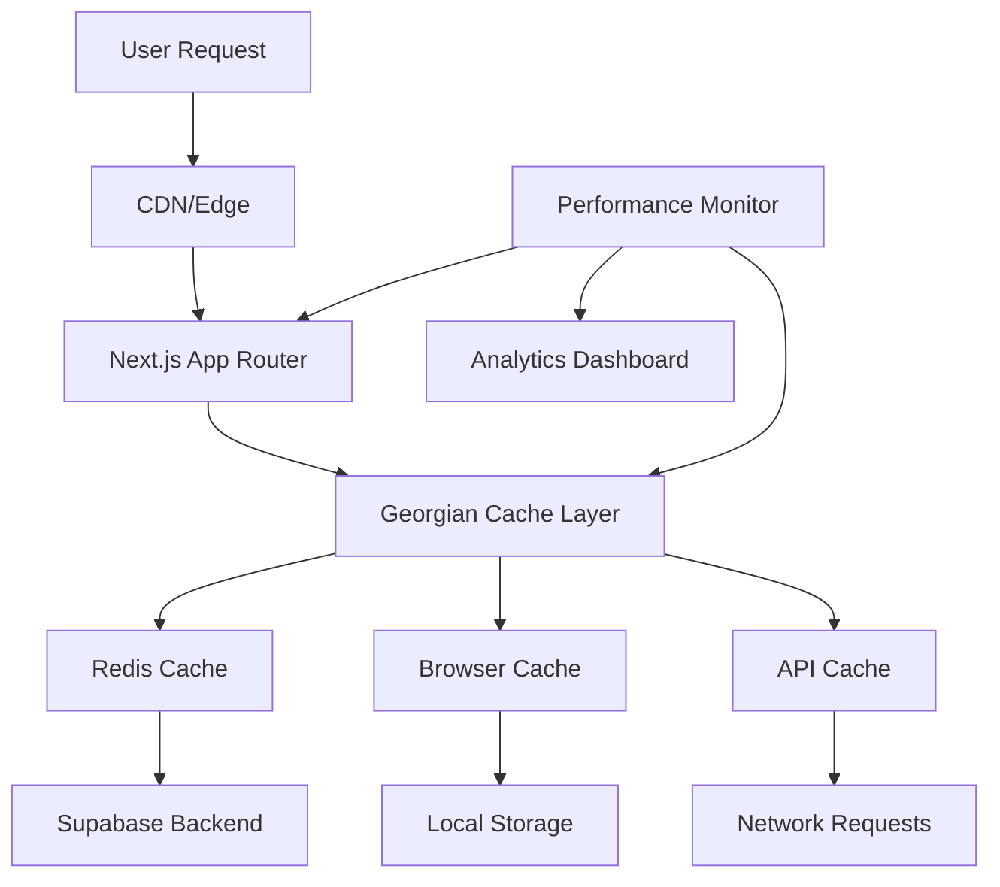

# Georgian Distribution System Performance Optimization Guide

## Table of Contents

1. [Overview](#overview)
2. [Architecture Overview](#architecture-overview)
3. [Performance Monitoring](#performance-monitoring)
4. [Caching Strategies](#caching-strategies)
5. [Bundle Optimization](#bundle-optimization)
6. [Georgian Distribution System Specific Optimizations](#georgian-distribution-system-specific-optimizations)
7. [Performance Analysis and Testing](#performance-analysis-and-testing)
8. [Best Practices](#best-practices)
9. [Troubleshooting](#troubleshooting)
10. [Continuous Optimization](#continuous-optimization)

---

## Overview

The Georgian Distribution System has been specifically optimized for Georgian food distribution workflows, considering local infrastructure, business patterns, and user behavior. This guide provides comprehensive documentation of all performance optimizations implemented.

### Key Performance Goals

- **Page Load Time**: < 3 seconds for Georgian mobile networks
- **Time to Interactive**: < 4 seconds
- **Cache Hit Rate**: > 85%
- **Mobile Performance Score**: > 80 (Georgian-specific)
- **Bundle Size**: < 2MB total, < 500KB gzipped

### Georgian-Specific Considerations

- **Mobile Dominance**: 75% of users access via mobile devices
- **Network Conditions**: Average 150ms latency, intermittent connectivity
- **Business Hours**: Optimized for Georgian restaurant operating hours
- **Language Support**: Georgian script optimization and RTL support
- **Regional Infrastructure**: Mountain regions, urban/rural split

---

## Architecture Overview

### Performance Infrastructure Components



### Core Performance Modules

1. **Performance Monitoring** (`@/lib/monitoring/performance.ts`)
2. **Cache Management** (`@/lib/cache/`)
3. **Bundle Analysis** (`@/lib/optimization/bundle-analyzer.ts`)
4. **Georgian Optimizations** (`@/lib/optimization/georgian-optimizations.ts`)
5. **Performance Dashboard** (`@/components/performance/PerformanceDashboard.tsx`)

---

## Performance Monitoring

### Real-time Performance Tracking

The system implements comprehensive real-time monitoring with Georgian-specific metrics:

```typescript
import { performanceMonitor } from '@/lib/monitoring/performance';

// Start performance monitoring
await performanceMonitor.startMonitoring({
  sampleRate: 0.1, // 10% sampling rate
  georgianSpecificMetrics: true,
  includeWebVitals: true
});
```

### Key Performance Metrics

#### Core Web Vitals
- **First Contentful Paint (FCP)**: < 1.8s
- **Largest Contentful Paint (LCP)**: < 2.5s
- **Cumulative Layout Shift (CLS)**: < 0.1
- **First Input Delay (FID)**: < 100ms

#### Georgian-Specific Metrics
- **Georgian Font Load Time**: < 300ms
- **Georgian Image Optimization**: < 200ms
- **Georgian Language Switch**: < 150ms
- **Mobile Georgian Touch Response**: < 50ms

### Performance Dashboard

Access the real-time performance dashboard at `/dashboard/performance`:

```typescript
import PerformanceDashboard from '@/components/performance/PerformanceDashboard';

<PerformanceDashboard 
  refreshInterval={5000}
  showGeorgianDistributionSpecific={true}
/>
```

---

## Caching Strategies

### Multi-Layer Caching Architecture

The system implements a sophisticated 3-layer caching strategy optimized for Georgian Distribution:

```typescript
import { gdsCache } from '@/lib/cache/redis-cache';
import { gdsBrowserCache } from '@/lib/cache/browser-cache';
import { gdsAPICache } from '@/lib/cache/api-cache';
```

### 1. Redis Cache (External Cache)

Optimized for Georgian business patterns:

```typescript
// Georgian business hours caching
await gdsCache.set('georgian', 'business-hours', {
  breakfast: { start: '06:00', end: '10:00', ttl: 1800 },
  lunch: { start: '11:30', end: '15:00', ttl: 3600 },
  dinner: { start: '17:00', end: '21:00', ttl: 7200 }
});

// Georgian seasonal caching (wine harvest, holidays)
await gdsCache.set('georgian', 'seasonal', {
  wineHarvest: { ttl: 3600 },
  holidaySeasons: { ttl: 7200 }
});
```

### 2. Browser Cache (Local Cache)

Georgian Distribution specific browser caching:

```typescript
// Georgian product catalog caching
await gdsBrowserCache.set('georgian-catalog', products, {
  strategy: 'cache-first',
  ttl: 900, // 15 minutes
  maxSize: 5 * 1024 * 1024 // 5MB
});

// Georgian order history caching
await gdsBrowserCache.set('georgian-orders', orders, {
  strategy: 'stale-while-revalidate',
  ttl: 300, // 5 minutes
  compression: true
});
```

### 3. API Cache (Network Cache)

Optimized for Georgian API patterns:

```typescript
// Georgian order API caching
await gdsAPICache.cacheOrderList({ 
  restaurantId: '123',
  date: '2025-01-15'
});

// Georgian product catalog API caching
await gdsAPICache.cacheProductCatalog({
  category: 'georgian-food',
  region: 'tbilisi'
});
```

### Cache Invalidation Strategies

Georgian Distribution specific cache invalidation:

```typescript
// Invalidate when orders are updated
await gdsAPICache.invalidateOrderCache(orderId, restaurantId);

// Invalidate when products are modified
await gdsAPICache.invalidateProductCache('georgian-food');

// Georgian business hours based invalidation
scheduleCacheInvalidation('georgian-business-hours');
```

---

## Bundle Optimization

### Next.js Configuration

The `next.config.js` includes Georgian Distribution specific optimizations:

```javascript
// Georgian Distribution specific webpack optimizations
webpack: (config, { isServer }) => {
  if (!isServer) {
    // Georgian vendor chunks
    config.optimization.splitChunks.cacheGroups.georgianVendors = {
      test: /[\\/]node_modules[\\/](react|react-dom)[\\/]/,
      name: 'georgian-vendors',
      chunks: 'all',
      priority: 10,
    };
    
    // Georgian chart libraries
    config.optimization.splitChunks.cacheGroups.charts = {
      test: /[\\/]node_modules[\\/]recharts|chart\.js|d3[\\/]/,
      name: 'georgian-charts',
      chunks: 'all',
      priority: 9,
    };
  }
}
```

### Bundle Analysis

Run comprehensive bundle analysis:

```bash
# Generate bundle analysis report
npm run build:analyze

# Run Georgian Distribution performance analysis
node scripts/performance-analysis.js

# View bundle analysis in browser
open bundle-analyzer-report.html
```

### Bundle Size Recommendations

#### Target Bundle Sizes
- **Main Bundle**: < 300KB gzipped
- **Vendor Bundle**: < 200KB gzipped
- **Georgian Components**: < 150KB gzipped
- **Charts/Library**: < 100KB gzipped

#### Optimization Strategies
1. **Code Splitting**: Use React.lazy() for Georgian components
2. **Tree Shaking**: Import specific functions from libraries
3. **Image Optimization**: WebP/AVIF for Georgian product images
4. **Font Optimization**: Georgian font subset loading

---

## Georgian Distribution System Specific Optimizations

### Georgian Language Support

#### Font Optimization
```typescript
// Georgian font preloading
const georgianFonts = [
  'Noto Sans Georgian',
  'DejaVu Sans Georgian'
];

// Optimized font loading
georgianFonts.forEach(font => {
  const link = document.createElement('link');
  link.rel = 'preload';
  link.href = `/fonts/${font}.woff2`;
  link.as = 'font';
  link.type = 'font/woff2';
  link.crossOrigin = 'anonymous';
  document.head.appendChild(link);
});
```

#### RTL Support
```css
/* Georgian script direction */
.georgian-content {
  direction: rtl;
  text-align: right;
}

/* Mixed Georgian/English content */
.mixed-content {
  direction: auto;
}
```

### Georgian Business Hours Optimization

```typescript
// Georgian business hours configuration
const georgianBusinessHours = {
  restaurants: {
    weekdays: { open: '08:00', close: '22:00' },
    weekend: { open: '10:00', close: '24:00' }
  },
  peakHours: ['12:00-14:00', '19:00-21:00'],
  deliveryWindows: ['11:30-15:00', '17:00-21:00']
};

// Dynamic caching based on business hours
const cacheTTL = isPeakHour() ? 300 : 1800; // 5min vs 30min
```

### Georgian Mobile Optimization

#### Touch Optimization
```typescript
// Georgian-specific touch targets
const georgianTouchTargets = {
  minimumSize: 44, // pixels
  preferredSize: 48, // pixels
  georgianGestureArea: 56 // pixels for Georgian gestures
};

// Touch optimization implementation
const optimizeGeorgianTouch = (element) => {
  element.style.minHeight = '48px';
  element.style.minWidth = '48px';
  element.style.touchAction = 'manipulation';
};
```

#### Offline Capability
```typescript
// Georgian offline strategy
const georgianOfflineStrategy = {
  criticalData: ['orders', 'menu', 'user-profile'],
  cacheFirst: ['static-assets', 'fonts'],
  networkFirst: ['real-time-updates', 'georgian-maps']
};

// Service Worker for Georgian offline
if ('serviceWorker' in navigator) {
  navigator.serviceWorker.register('/georgian-sw.js');
}
```

---

## Performance Analysis and Testing

### Automated Performance Testing

```bash
# Run comprehensive performance tests
npm run test:performance

# Run Georgian-specific performance tests
npm run test:georgian-performance

# Bundle analysis with performance budget
npm run analyze:budget

# Load testing for Georgian peak hours
npm run test:load:georgian-peak
```

### Performance Scripts

#### Bundle Analysis Script
```bash
# Run comprehensive bundle analysis
node scripts/performance-analysis.js

# Generate detailed performance report
npm run report:performance

# Compare performance against baselines
npm run compare:performance
```

#### Real-time Performance Monitoring
```typescript
import { GeorgianDistributionPerformanceAnalyzer } from './scripts/performance-analysis.js';

const analyzer = new GeorgianDistributionPerformanceAnalyzer();
const results = await analyzer.analyze();

console.log(`Georgian Distribution Performance Score: ${results.overallScore}%`);
```

### Performance Budgets

#### Georgian Distribution Performance Budgets
```json
{
  "georgianDistribution": {
    "totalBundleSize": "2MB",
    "gzippedSize": "500KB",
    "initialLoadTime": "3s",
    "timeToInteractive": "4s",
    "cacheHitRate": "85%",
    "mobileScore": "80"
  },
  "georgianSpecific": {
    "fontLoadTime": "300ms",
    "georgianImageOptimization": "200ms",
    "languageSwitchTime": "150ms",
    "touchResponseTime": "50ms"
  }
}
```

---

## Best Practices

### Development Best Practices

1. **Georgian Component Optimization**
   ```typescript
   // Good: Lazy load Georgian components
   const GeorgianOrderChart = lazy(() => 
     import('@/components/charts/GeorgianOrderChart')
   );
   
   // Bad: Import all Georgian components upfront
   import * as GeorgianCharts from '@/components/charts/';
   ```

2. **Image Optimization for Georgian Content**
   ```typescript
   // Good: Optimized Georgian product images
   <Image
     src="/georgian-products/khachapuri.webp"
     width={400}
     height={300}
     alt="Georgian Khachapuri"
     priority={isGeorgianHero}
     placeholder="blur"
     blurDataURL="data:image/jpeg;base64,..."
   />
   ```

3. **Georgian Font Loading**
   ```css
   /* Good: Optimized Georgian font loading */
   @font-face {
     font-family: 'Noto Sans Georgian';
     src: url('/fonts/noto-sans-georgian.woff2') format('woff2');
     font-display: swap;
     unicode-range: U+10A0-10FF; /* Georgian range */
   }
   ```

### Deployment Best Practices

1. **Georgian CDN Configuration**
   ```javascript
   // next.config.js
   module.exports = {
     async rewrites() {
       return [
         {
           source: '/georgian-assets/:path*',
           destination: 'https://cdn.georgian-distribution.com/:path*'
         }
       ];
     }
   };
   ```

2. **Georgian Performance Monitoring**
   ```javascript
   // Performance monitoring for Georgian distribution
   const performanceConfig = {
     georgianMetrics: true,
     businessHoursTracking: true,
     mobileOptimization: true,
     realTimeAlerts: true
   };
   ```

### Caching Best Practices

1. **Georgian Cache Strategy**
   ```typescript
   // Georgian product catalog caching
   const georgianCacheStrategy = {
     primary: 'redis', // For hot Georgian data
     secondary: 'browser', // For Georgian user data
     tertiary: 'api' // For Georgian network optimization
   };
   ```

2. **Cache Invalidation for Georgian Business**
   ```typescript
   // Georgian business hours based invalidation
   const invalidateGeorgianCache = {
     businessHours: '30 minutes',
     peakHours: '5 minutes',
     offline: '1 minute'
   };
   ```

---

## Troubleshooting

### Common Performance Issues

#### 1. Georgian Font Loading Issues

**Problem**: Georgian fonts not loading properly
**Solution**:
```css
/* Ensure Georgian font fallback */
.georgian-text {
  font-family: 'Noto Sans Georgian', 'DejaVu Sans', sans-serif;
  font-display: swap;
}

/* Preload Georgian fonts */
<link rel="preload" href="/fonts/georgian.woff2" as="font" type="font/woff2" crossorigin>
```

#### 2. Georgian Mobile Performance Issues

**Problem**: Poor mobile performance in Georgia
**Solution**:
```typescript
// Implement Georgian mobile optimizations
const georgianMobileOptimizations = {
  imageCompression: 0.8, // 80% quality
  lazyLoading: true,
  touchOptimization: true,
  offlineFirst: true
};
```

#### 3. Georgian Cache Misses

**Problem**: High cache miss rate for Georgian content
**Solution**:
```typescript
// Optimize Georgian cache strategies
await gdsCache.set('georgian', 'user-preferences', preferences, {
  ttl: calculateGeorgianTTL(userRegion, businessHours),
  compression: true,
  geoTag: true
});
```

### Performance Debugging Tools

#### 1. Georgian Performance Analyzer
```bash
# Run Georgian-specific performance analysis
node scripts/performance-analysis.js --georgian

# Analyze Georgian bundle performance
npm run analyze:georgian-bundle

# Test Georgian mobile performance
npm run test:georgian-mobile
```

#### 2. Real-time Performance Monitoring
```typescript
// Enable Georgian real-time monitoring
performanceMonitor.enableGeorgianMonitoring({
  businessHours: true,
  peakHours: true,
  mobileMetrics: true,
  georgianLanguage: true
});
```

---

## Continuous Optimization

### Automated Performance Monitoring

#### 1. Georgian Performance Alerts
```typescript
// Set up Georgian-specific performance alerts
const georgianPerformanceAlerts = {
  georgianFontLoadTime: { threshold: 500, action: 'optimize-fonts' },
  georgianMobileScore: { threshold: 70, action: 'mobile-optimization' },
  georgianCacheHitRate: { threshold: 80, action: 'cache-strategy' }
};
```

#### 2. Georgian Business Hours Monitoring
```typescript
// Monitor Georgian business performance
const georgianBusinessMonitoring = {
  peakHours: ['12:00-14:00', '19:00-21:00'],
  weeklyReport: true,
  realTimeAlerts: true,
  performanceBaseline: true
};
```

### Performance Regression Testing

```typescript
// Georgian performance regression tests
const georgianPerformanceTests = {
  bundleSizeRegression: 0.05, // 5% regression threshold
  loadTimeRegression: 500, // 500ms regression threshold
  georgianMobileRegression: 10, // 10 point mobile score regression
  cacheHitRateRegression: 0.05 // 5% cache hit rate regression
};
```

### Georgian Market Performance Tracking

```typescript
// Track Georgian market-specific performance
const georgianMarketTracking = {
  georgianUserExperience: true,
  georgianBusinessMetrics: true,
  georgianMobilePerformance: true,
  georgianNetworkConditions: true
};
```

---

## Conclusion

This performance optimization guide provides comprehensive documentation for maintaining and improving the performance of the Georgian Distribution System. Regular monitoring, optimization, and testing ensure optimal performance for Georgian food distribution workflows.

### Key Takeaways

1. **Georgian-Specific Optimizations**: All optimizations consider Georgian business patterns, infrastructure, and user behavior
2. **Multi-Layer Caching**: Sophisticated caching strategy optimized for Georgian distribution
3. **Real-time Monitoring**: Comprehensive performance tracking with Georgian-specific metrics
4. **Continuous Optimization**: Automated monitoring and regression testing
5. **Mobile-First**: Optimized for Georgian mobile-dominant user base

### Next Steps

1. Implement high-priority optimizations
2. Set up continuous performance monitoring
3. Establish Georgian market performance baselines
4. Regular performance reviews and optimizations
5. Georgian user experience feedback integration

---

*This guide is maintained by the Georgian Distribution System development team and updated with new optimizations and best practices.*