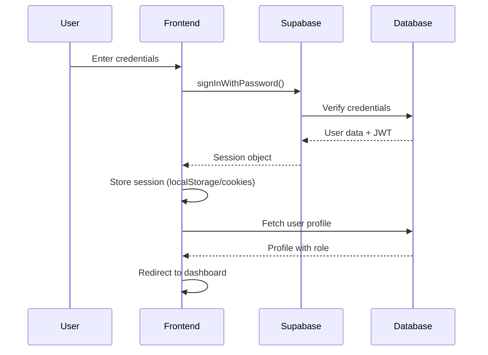

# Authentication API Documentation

**Version**: 1.0.0
**Last Updated**: 2025-11-05
**Base URL**: `/api/auth` or Supabase Auth
**Authentication**: Session-based with JWT tokens

---

## Overview

The Distribution Management System uses **Supabase Authentication** with custom session management. Sessions persist for 5 hours by default, with optional "Remember Me" functionality extending sessions to 30 days.

---

## Authentication Flow



---

## Endpoints

### 1. Login

**Method**: `POST`
**Endpoint**: Supabase Auth (`supabase.auth.signInWithPassword()`)
**Description**: Authenticates user and creates session

**Request Body**:
```typescript
{
  email: string      // User email address
  password: string   // User password
}
```

**Response** (Success - 200):
```typescript
{
  data: {
    user: {
      id: string
      email: string
      user_metadata: {
        full_name?: string
      }
    }
    session: {
      access_token: string
      refresh_token: string
      expires_at: number        // Unix timestamp (seconds)
      expires_in: number        // 18000 (5 hours)
      token_type: "bearer"
      user: User
    }
  }
  error: null
}
```

**Response** (Error - 400/401):
```typescript
{
  data: null
  error: {
    message: string             // "Invalid login credentials"
    status: 400 | 401
    name: "AuthApiError"
  }
}
```

**Example Usage**:
```typescript
import { createBrowserClient } from '@/lib/supabase'

const supabase = createBrowserClient()

async function login(email: string, password: string, rememberMe: boolean = false) {
  const { data, error } = await supabase.auth.signInWithPassword({
    email,
    password
  })

  if (error) {
    throw new Error(error.message)
  }

  // Store "Remember Me" preference
  if (rememberMe) {
    localStorage.setItem('remember-me', 'true')
    document.cookie = `remember-me=true; max-age=${30 * 24 * 60 * 60}; path=/; SameSite=Lax`
  }

  return data
}
```

---

### 2. Logout

**Method**: `POST`
**Endpoint**: Supabase Auth (`supabase.auth.signOut()`)
**Description**: Destroys user session and clears tokens

**Request**: None (uses session token from cookies)

**Response** (Success - 200):
```typescript
{
  error: null
}
```

**Example Usage**:
```typescript
async function logout() {
  const { error } = await supabase.auth.signOut()

  if (error) {
    throw new Error(error.message)
  }

  // Clear local storage
  localStorage.removeItem('remember-me')
  localStorage.removeItem('cart')

  // Redirect to login
  window.location.href = '/login'
}
```

---

### 3. Get Session

**Method**: `GET`
**Endpoint**: Supabase Auth (`supabase.auth.getSession()`)
**Description**: Retrieves current session from storage

**Request**: None

**Response** (Session exists - 200):
```typescript
{
  data: {
    session: {
      access_token: string
      refresh_token: string
      expires_at: number
      user: User
    }
  }
  error: null
}
```

**Response** (No session - 200):
```typescript
{
  data: {
    session: null
  }
  error: null
}
```

**⚠️ Security Warning**:
```typescript
// ❌ BAD: Using getSession() alone is insecure
const { data: { session } } = await supabase.auth.getSession()
const user = session?.user // May not be authentic!

// ✅ GOOD: Always verify with getUser()
const { data: { user }, error } = await supabase.auth.getUser()
// This authenticates against Supabase Auth server
```

---

### 4. Get Authenticated User

**Method**: `GET`
**Endpoint**: Supabase Auth (`supabase.auth.getUser()`)
**Description**: Fetches and verifies current user from Auth server

**Request**: None (uses session token)

**Response** (Success - 200):
```typescript
{
  data: {
    user: {
      id: string
      email: string
      email_confirmed_at: string
      created_at: string
      user_metadata: {
        full_name?: string
      }
    }
  }
  error: null
}
```

**Response** (Unauthorized - 401):
```typescript
{
  data: {
    user: null
  }
  error: {
    message: "Invalid token"
    status: 401
  }
}
```

---

### 5. Refresh Session

**Method**: `POST`
**Endpoint**: Supabase Auth (`supabase.auth.refreshSession()`)
**Description**: Refreshes expired session using refresh token

**Request**:
```typescript
{
  refresh_token?: string  // Optional, uses stored token if omitted
}
```

**Response** (Success - 200):
```typescript
{
  data: {
    session: {
      access_token: string    // New access token
      refresh_token: string   // New refresh token
      expires_at: number
      user: User
    }
  }
  error: null
}
```

**Example Usage**:
```typescript
async function refreshSession() {
  const { data, error } = await supabase.auth.refreshSession()

  if (error) {
    // Refresh failed, redirect to login
    window.location.href = '/login'
    return
  }

  return data.session
}
```

---

### 6. Get User Profile

**Method**: `GET`
**Endpoint**: Database query to `profiles` table
**Description**: Fetches user profile data including role

**Request**: Uses authenticated user ID from session

**Response** (Success - 200):
```typescript
{
  id: string              // UUID matching auth.users.id
  email: string
  full_name: string | null
  role: 'admin' | 'restaurant' | 'driver'
  restaurant_name: string | null
  phone_number: string | null
  address: string | null
  is_active: boolean
  created_at: string
  updated_at: string
}
```

**Example Usage**:
```typescript
async function getUserProfile(userId: string) {
  const { data, error } = await supabase
    .from('profiles')
    .select('*')
    .eq('id', userId)
    .single()

  if (error) {
    throw new Error(`Failed to fetch profile: ${error.message}`)
  }

  return data
}
```

---

## Session Management

### Session Configuration

| Setting | Value | Description |
|---------|-------|-------------|
| **JWT Expiry** | 18000 seconds (5 hours) | Configured in `supabase/config.toml` |
| **Session Timeout** | 5 hours | Client-side monitoring in `authStore.ts` |
| **Warning Time** | 10 minutes | Warning shown before expiry |
| **Remember Me Duration** | 30 days | Optional extended session |

### Session Storage

Sessions are stored in multiple locations:
1. **LocalStorage**: `supabase.auth.token` (primary)
2. **Cookies**: HTTP-only cookies for SSR (set by Supabase)
3. **Auth Store**: Zustand store for React state

### Session Monitoring

The auth store automatically monitors session expiry:

```typescript
// authStore.ts
const SESSION_TIMEOUT = 5 * 60 * 60 * 1000  // 5 hours
const WARNING_TIME = 10 * 60 * 1000         // 10 minutes

// Checks every minute
setInterval(() => {
  const timeLeft = session.expires_at * 1000 - Date.now()

  if (timeLeft <= 0) {
    // Session expired - force logout
    logout()
  } else if (timeLeft <= WARNING_TIME) {
    // Show warning
    showSessionWarning(timeLeft)
  }
}, 60000)
```

---

## Role-Based Access Control (RBAC)

### User Roles

| Role | Access Level | Redirects To | Permissions |
|------|-------------|--------------|-------------|
| **admin** | Full system access | `/dashboard/admin` | Manage users, products, orders, analytics |
| **restaurant** | Restaurant management | `/dashboard/restaurant` | Create orders, view own orders, manage products |
| **driver** | Delivery operations | `/dashboard/driver` | View assigned orders, update delivery status |

### Middleware Protection

Routes are protected by Next.js middleware:

```typescript
// middleware.ts
export async function middleware(request: NextRequest) {
  const { data: { user } } = await supabase.auth.getUser()

  if (!user) {
    return NextResponse.redirect(new URL('/login', request.url))
  }

  // Fetch user role
  const { data: profile } = await supabase
    .from('profiles')
    .select('role')
    .eq('id', user.id)
    .single()

  // Role-based redirects
  const path = request.nextUrl.pathname

  if (path.startsWith('/dashboard/admin') && profile?.role !== 'admin') {
    return NextResponse.redirect(new URL('/dashboard', request.url))
  }

  if (path.startsWith('/dashboard/restaurant') && profile?.role !== 'restaurant') {
    return NextResponse.redirect(new URL('/dashboard', request.url))
  }

  if (path.startsWith('/dashboard/driver') && profile?.role !== 'driver') {
    return NextResponse.redirect(new URL('/dashboard', request.url))
  }

  return NextResponse.next()
}
```

---

## Error Handling

### Common Error Codes

| Error Code | Message | Cause | Solution |
|------------|---------|-------|----------|
| **400** | "Invalid login credentials" | Wrong email/password | Verify credentials |
| **401** | "Invalid token" | Expired or invalid JWT | Refresh session or re-login |
| **422** | "Email not confirmed" | Email verification pending | Check email for verification link |
| **429** | "Email rate limit exceeded" | Too many requests | Wait before retrying |
| **500** | "Database error" | Server-side issue | Check Supabase status |

### Error Handling Example

```typescript
async function handleLogin(email: string, password: string) {
  try {
    const { data, error } = await supabase.auth.signInWithPassword({
      email,
      password
    })

    if (error) {
      switch (error.status) {
        case 400:
        case 401:
          toast.error('Invalid email or password')
          break
        case 422:
          toast.error('Please verify your email address')
          break
        case 429:
          toast.error('Too many attempts. Please try again later')
          break
        default:
          toast.error('An error occurred. Please try again')
      }
      return
    }

    // Success - redirect to dashboard
    router.push('/dashboard')

  } catch (err) {
    logger.error('Login error:', err)
    toast.error('Unexpected error occurred')
  }
}
```

---

## Security Best Practices

### 1. Always Use getUser() for Authentication

```typescript
// ❌ NEVER do this
const { data: { session } } = await supabase.auth.getSession()
if (session?.user) {
  // This user object may not be authentic!
}

// ✅ ALWAYS do this
const { data: { user }, error } = await supabase.auth.getUser()
if (user) {
  // This user is authenticated by Supabase Auth server
}
```

### 2. Protect Sensitive Routes

All dashboard routes are protected by middleware. Never rely solely on client-side checks.

### 3. Clear Sessions on Logout

```typescript
async function secureLogout() {
  // 1. Sign out from Supabase
  await supabase.auth.signOut()

  // 2. Clear local storage
  localStorage.clear()

  // 3. Clear cookies
  document.cookie.split(";").forEach(c => {
    document.cookie = c.replace(/^ +/, "").replace(/=.*/, "=;expires=" + new Date().toUTCString() + ";path=/")
  })

  // 4. Redirect to login
  window.location.href = '/login'
}
```

### 4. Refresh Tokens Proactively

```typescript
// Refresh token 5 minutes before expiry
const REFRESH_THRESHOLD = 5 * 60 * 1000  // 5 minutes

setInterval(async () => {
  const { data: { session } } = await supabase.auth.getSession()

  if (session) {
    const expiresAt = session.expires_at * 1000
    const timeUntilExpiry = expiresAt - Date.now()

    if (timeUntilExpiry < REFRESH_THRESHOLD) {
      await supabase.auth.refreshSession()
    }
  }
}, 60000)  // Check every minute
```

---

## Related Files

- [LoginForm.tsx](cci:1://file:///c:/Users/SITECH/Desktop/DEV/Distribution-Managment/frontend/src/components/auth/LoginForm.tsx:0:0-0:0) - Login UI component
- [authStore.ts](cci:1://file:///c:/Users/SITECH/Desktop/DEV/Distribution-Managment/frontend/src/store/authStore.ts:0:0-0:0) - Zustand auth state management
- [middleware.ts](cci:1://file:///c:/Users/SITECH/Desktop/DEV/Distribution-Managment/frontend/src/middleware.ts:0:0-0:0) - Route protection
- [supabase/client.ts](cci:1://file:///c:/Users/SITECH/Desktop/DEV/Distribution-Managment/frontend/src/lib/supabase/client.ts:0:0-0:0) - Supabase client configuration

---

## Testing Authentication

### Manual Testing

1. **Login Test**:
   ```bash
   # Navigate to login page
   http://localhost:3000/login

   # Test credentials
   Email: admin@example.com
   Password: admin123
   ```

2. **Session Persistence Test**:
   - Login with "Remember Me" checked
   - Close browser
   - Reopen browser
   - Navigate to protected route
   - Should remain logged in

3. **Session Expiry Test**:
   - Login without "Remember Me"
   - Wait 5 hours (or modify SESSION_TIMEOUT for testing)
   - Attempt to access protected route
   - Should redirect to login

### Automated Testing

```typescript
// auth.test.ts
import { createBrowserClient } from '@/lib/supabase'

describe('Authentication', () => {
  it('should login with valid credentials', async () => {
    const supabase = createBrowserClient()
    const { data, error } = await supabase.auth.signInWithPassword({
      email: 'test@example.com',
      password: 'password123'
    })

    expect(error).toBeNull()
    expect(data.user).toBeDefined()
    expect(data.session).toBeDefined()
  })

  it('should reject invalid credentials', async () => {
    const supabase = createBrowserClient()
    const { data, error } = await supabase.auth.signInWithPassword({
      email: 'wrong@example.com',
      password: 'wrongpass'
    })

    expect(error).toBeDefined()
    expect(error?.status).toBe(400)
  })
})
```

---

**Last Updated**: 2025-11-05
**Maintained By**: Development Team
**Status**: ✅ Production Ready
